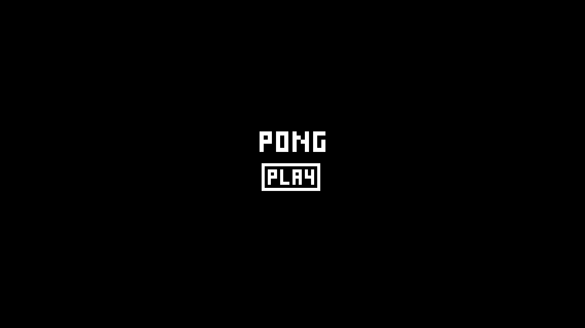

Pong
====

Pong is one of the earliest arcade video games; is a two-dimensional sports game that simulates table tennis. The player controls an in-game paddle by moving it vertically across the left side of the screen, and can compete against either a computer-controlled opponent or another player controlling a second paddle on the opposing side. Players use the paddles to hit a ball back and forth. The aim is for each player to reach eleven points before the opponent; points are earned when one fails to return the ball to the other.

Dependecies
===========

* OpenGL
* OpenAL
* DevIL
* SDL2
* Alut

---
* On an **Unix based system**, you need to do your own house keeping and install these dependencies.
* On **Windows**, all the dependecies are included under the deps directory.

Building
========
To build the game from the source you will need [cmake](http://www.cmake.org/). 

    cd Pong
    mkdir build
    cd build
    cmake ..
    make

Supported Platforms
===================

* Windows
* GNU/Linux

How the game looks
==================

